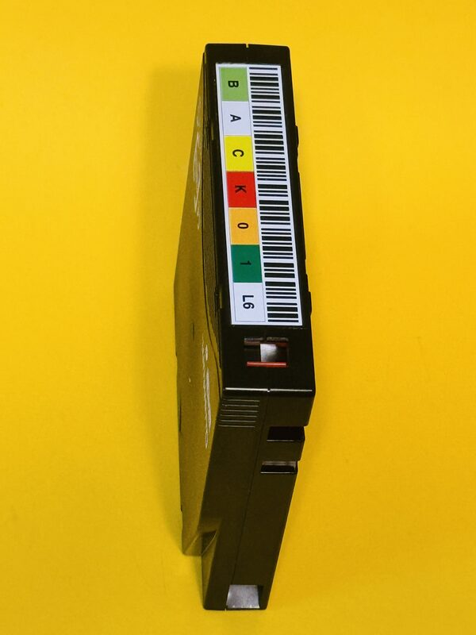

<!-- Filename: README.md -->
<!-- Version: 4 -->
<!-- Date: 2026-05-11T22:30:00Z -->
<!-- Author: Lucky Green in collaboration with ChatGPT and Claude -->
<!-- Purpose: GitHub repository documentation for LTO-Labels-Generator-A4-Laser.
     Covers usage, barcode encoding modes, dependencies, and print instructions. -->
<!-- Usage: View in Markdown renderer or GitHub -->

# LTO-Labels-Generator-A4-Laser

<a href="LTO-Label-Laser.jpeg"></a>

Generate A4 PDF sheets of LTO tape barcode labels for **laser-printer-only** polyester label stock such as Avery 4775 / L4775.

Each page fits 30 labels arranged in two columns of 15 rows. Labels are 79 mm × 17 mm. Color and black-and-white modes are supported. Cut guides extend to the paper edge.

LTO media is rated for archival lifetimes of up to 50 years. The label must outlast the tape. Inkjet-printed and paper-based labels are not suitable for this purpose — LTO longevity and no-smear requirements logically preclude them, even though the LTO specification does not explicitly ban them. Avery 4775 polyester labels are water, UV, and temperature resistant (−20 °C to +80 °C) and are rated for laser printing only.

If you find this script useful, please consider starring the repository.

---

## Requirements

- Debian / Ubuntu with `bash`, `apt`, `sudo`, and internet access (tested on Ubuntu 24.04)
- The script installs missing dependencies automatically: `ca-certificates`, `curl`, `file`, `python3`, `uv`, and the `reportlab` Python package
- `sudo` is only required if system packages or `uv` are absent

---

## Usage

```
./LTO-Labels-Generator-A4-Laser-Printer-Only.sh [-h|--help]
./LTO-Labels-Generator-A4-Laser-Printer-Only.sh (-6|--6|-8|--8) [-bw|--bw] [--output-dir DIR] LABEL[,LABEL...]
```

### Barcode encoding — required flag

**`-6` / `--6`** — Six-character barcode mode. The barcode encodes only the VOLSER (e.g., `BKUP01`). The generation suffix (e.g., `L8`) appears in the visual label cells but is not encoded in the barcode. Use this when your tape library is configured for 6-character barcode mode.

**`-8` / `--8`** — Eight-character barcode mode. The barcode encodes VOLSER + generation suffix (e.g., `BKUP01L8`). Use this when your library is configured for 8-character barcode mode. This matches the IBMT LTO barcode standard and is the default on most modern libraries.

One of these flags is mandatory. The script aborts if neither or both are provided.

> **Warning:** All tapes in a single library must use the same barcode encoding. Mixing 6-char and 8-char barcodes in the same library causes the library to fail to inventory or load the mismatched tapes. Check your library's barcode mode setting before printing a batch.

### Other options

`-bw` / `--bw` — Generate black-and-white labels for monochrome laser printers. Default is color.

`--output-dir DIR` — Write the PDF to `DIR`. The directory must already exist and be writable. Default is the current working directory.

---

## Label input syntax

The final digit of every label token is the LTO generation. The preceding characters form the VOLSER prefix. The VOLSER is always padded to exactly six characters.

| Input | Output |
|---|---|
| `BACKUP7` | `BACKUP L7` |
| `bkup018` | `BKUP01 L8` |
| `bkup018-bkup108` | `BKUP01 L8` through `BKUP10 L8` |
| `bk16-36` | `BK0001 L6` through `BK0003 L6` |
| `test018-038` | `TEST01 L8` through `TEST03 L8` |

Multiple ranges or individual labels can be combined with commas: `bkup018-bkup058,TEST16-36`

Rules: every label must end in an LTO generation digit (1–9; 0 is invalid). Range endpoints must share the same prefix and generation. Descending ranges are not supported. Input is case-insensitive; printed output is always uppercase.

---

## Examples

Color labels for an 8-char library:
```bash
./LTO-Labels-Generator-A4-Laser-Printer-Only.sh -8 bkup018-bkup108,TEST16-36
```

Black-and-white labels for a 6-char library:
```bash
./LTO-Labels-Generator-A4-Laser-Printer-Only.sh -6 --bw bkup018-bkup108
```

Custom output directory:
```bash
./LTO-Labels-Generator-A4-Laser-Printer-Only.sh -8 --output-dir /tmp/labels bkup018-bkup108
```

---

## Output files

PDFs are written to the current working directory (or `--output-dir`) with auto-incrementing filenames:

```
LTO-Laser-Printer-Labels_01.pdf
LTO-Laser-Printer-Labels_02.pdf
...
LTO-Laser-Printer-Labels_99.pdf
```

The script supports up to 99 PDFs per directory. Delete or rename old PDFs to free a slot. The two-digit suffix is intentional.

---

## Printing

Print at **100% / Actual Size**. Disable "Fit to Page", "Shrink to Printable Area", and any other automatic scaling — these will shift the labels off the cut lines. Use laser label media settings in your print driver when available.

---

## Cutting

Labels must be cut by hand. A sharp rotary trimmer is strongly recommended over scissors. Cut guides are printed to the paper edge.

---

## Label orientation

Labels are generated in standard LTO vertical orientation: barcode on the right side when the label is applied to the cartridge spine. This is not configurable. Users wanting other orientations are welcome to fork the project.

---

## Barcode rendering

Barcodes are generated at a fixed bar width of 0.30 mm, meeting the IBMT LTO minimum of 0.254 mm (10 mil). The barcode is centered on the label; the white space on each side provides the required quiet zone.

---

## Supported LTO generations

L1 through L9. Generation L0 is not valid and is rejected. For generations beyond L9, pull requests are welcome.

---

## License

[CC0 1.0 Universal Public Domain Dedication](https://creativecommons.org/publicdomain/zero/1.0/)
